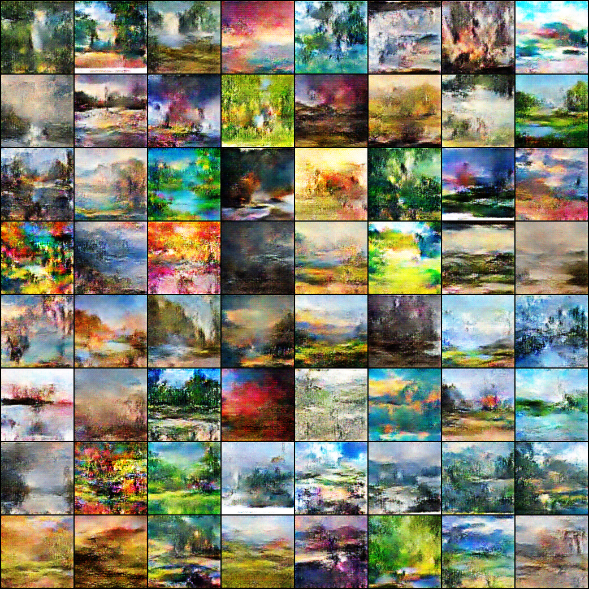
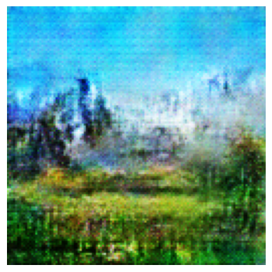
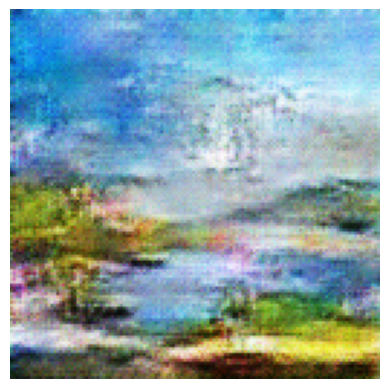
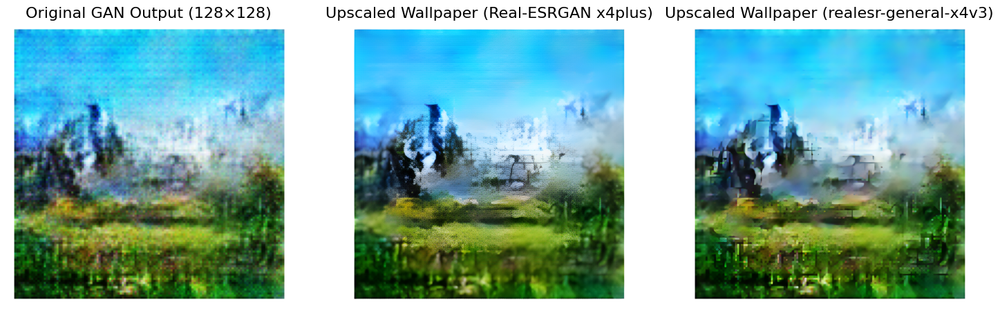
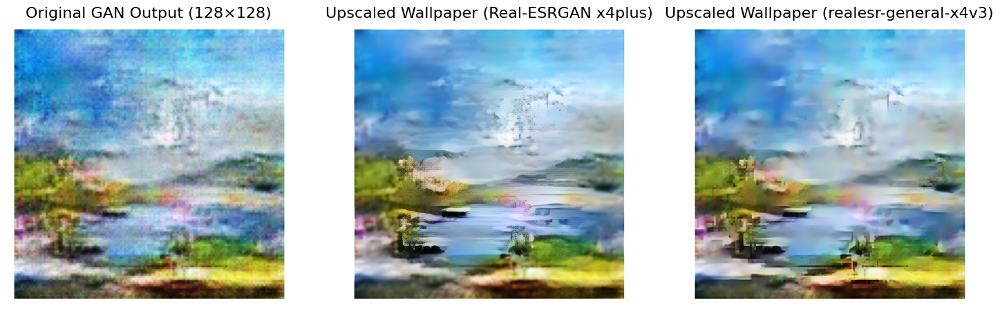

# Random Wallpaper Generator (DCGAN + Real-ESRGAN)

CSE 25 - University of California, San Diego

Team "The Best Boys": Nathan Man, Christian Tchakmakjian, Sergio Pena, Samuel Suner

This project trains a DCGAN to generate wallpaper-style images from a paintings dataset, then upscales the generated outputs using Real-ESRGAN for higher resolution

## Sample Images

### Image Grid at 110th epoch

### Single Samples

  
  

## Side-by-Side Comparison of Upscaling

  
   
  

